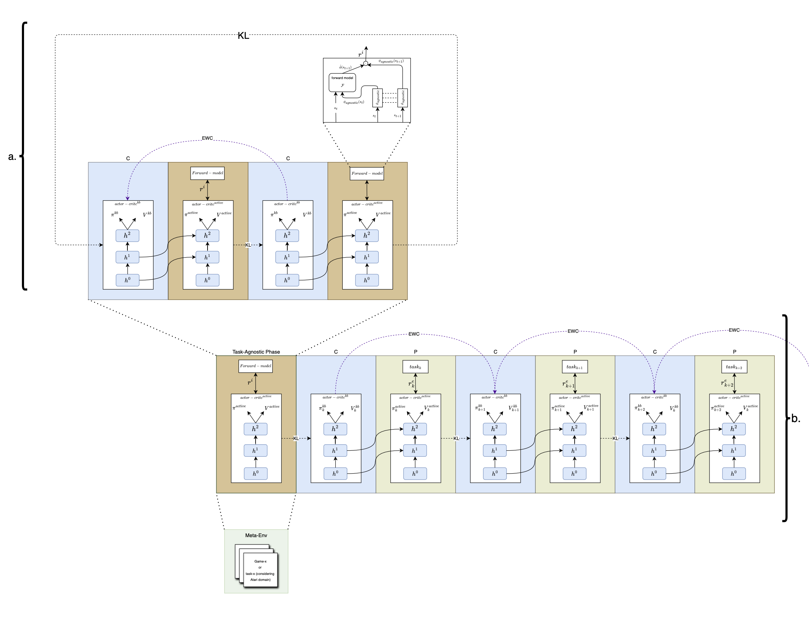

# Continual Deep Reinforcement Learning with Task-Agnostic Policy Distillation

Pytorch implementation for reproducing the results from the paper "Continual Deep Reinforcement Learning with Task-Agnostic Policy Distillation" by Muhammad Burhan Hafez and Kerim Erekmen accepted for publication at *Scientific Reports*.

Muhammad Burhan Hafez and Kerim Erekmen contributed equally to the development of the codebase and the experiments presented in this research.

## Abstract
Central to the development of universal learning systems is the ability to solve multiple tasks without retraining from scratch when new data arrives. This is crucial because each task requires significant training time. Addressing the problem of continual learning necessitates various methods due to the complexity of the problem space. This problem space includes: (1) addressing catastrophic forgetting to retain previously learned tasks, (2) demonstrating positive forward transfer for faster learning, (3) ensuring scalability across numerous tasks, and (4) facilitating learning without requiring task labels, even in the absence of clear task boundaries. In this paper, the **Task-Agnostic Policy Distillation (TAPD)** framework is introduced. This framework alleviates problems (1)-(4) by incorporating a task-agnostic phase, where an agent explores its environment without any external goal and maximizes only its intrinsic motivation. The knowledge gained during this phase is later distilled for further exploration. Therefore, the agent acts in a self-supervised manner by systematically seeking novel states. By utilizing task-agnostic distilled knowledge, the agent can solve downstream tasks more efficiently, leading to improved sample efficiency.



## Installation
To install the required packages, run the following command:
```bash
pip install -r requirements.txt
```
Make sure Python 3.8 or higher is installed on your system and that you use a virtual environment of your choice.

When running the code, make sure to use the following command:
```bash
python train.py --config config/example_progress_and_compress.yml
```
Here within the config folder, you can define various configuration files for different experiments.

**Additionally the implementation of the baseline might be the first in pytorch!: https://arxiv.org/abs/1805.06370.**

## Citation
If you find our work to be useful in your research, please consider citing our paper:
```
@article{hafez2024continual,
  title={Continual Deep Reinforcement Learning with Task-Agnostic Policy Distillation},
  author={Hafez, Muhammad Burhan and Erekmen, Kerim},
  journal={arXiv preprint arXiv:2411.16532},
  year={2024}
}
```

## Contact
Muhammad Burhan Hafez - [burhan.hafez@soton.ac.uk](burhan.hafez@soton.ac.uk), Kerim Erekmen - [kerim.erekmen@informatik.uni-hamburg.de](kerim.erekmen@informatik.uni-hamburg.de)
